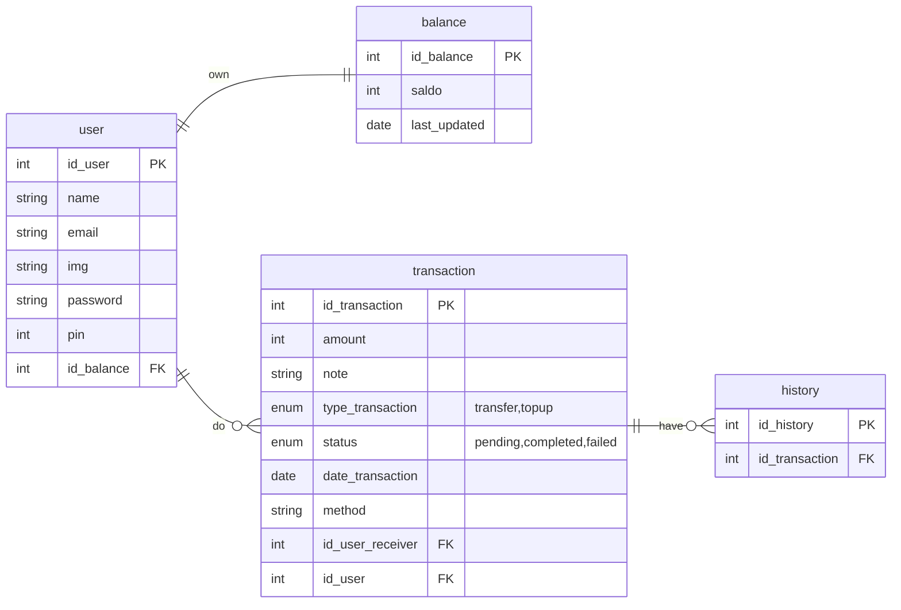

ERD E-WALLET

```mermaid
erDiagram
direction LR
    user ||--|| balance : own
 user ||--o{ transaction : do
    transaction ||--o{ history : have

    user {
        int id_user PK
        string name
        string email
        string img
        string password
        int pin
        int id_balance FK
    }

    balance {
        int id_balance PK
        int saldo
        date last_updated
    }


    transaction {
        int id_transaction PK
        int amount
        string note
        enum type_transaction "transfer,topup"
        enum status "pending,completed,failed"
        date date_transaction
        string method

        int id_user_receiver FK
        int id_user FK
    }

    history {
        int id_history PK
        int id_transaction FK
    }


```
